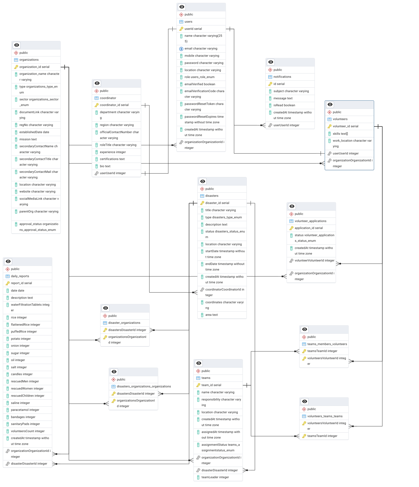

<head>
  <style>
    .copy-button {
      background-color: #eee;
      border: 1px solid #ccc;
      border-radius: 4px;
      padding: 2px 8px;
      font-size: 12px;
      cursor: pointer;
      margin-top: 5px;
      display: inline-block;
    }
    .copy-button:hover {
      background-color: #ddd;
    }
    .code-container {
      position: relative;
    }
  </style>
  <script>
    document.addEventListener('DOMContentLoaded', function() {
      document.querySelectorAll('.copy-button').forEach(button => {
        button.addEventListener('click', function() {
          const text = this.getAttribute('data-clipboard-text');
          navigator.clipboard.writeText(text).then(() => {
            // Change button text temporarily
            const originalText = this.textContent;
            this.textContent = '✓ Copied!';
            setTimeout(() => {
              this.textContent = originalText;
            }, 1500);
          });
        });
      });
    });
  </script>
</head>

# UDDHAR - Disaster Management Platform

![Uddhar Logo][logo]

[![Contributors][contributors-shield]][contributors-url]


<p align="center">
  <a href="#-overview">Overview</a> •
  <a href="#-table-of-contents">Table of Contents</a> •
  <a href="#-key-features">Key Features</a> •
  <a href="#-architecture">Architecture</a> •
  <a href="#-diagrams">Diagrams</a> •
  <a href="#-stakeholders">Stakeholders</a> •
  <a href="#-getting-started">Getting Started</a> •
  <a href="#%EF%B8%8F-technology-stack">Technology Stack</a> •
  <a href="#-api-documentation">API Documentation</a> •
  <a href="#-roadmap">Roadmap</a> •
  <a href="#-license">License</a>
</p>

## 📋 Overview

**Uddhar** is a comprehensive disaster management platform designed to streamline emergency response and volunteer coordination across Bangladesh. In a region highly vulnerable to natural calamities, Uddhar provides a centralized system that enhances coordination, facilitates effective resource allocation, and promotes rapid response during emergencies.

By leveraging technology, Uddhar connects volunteer organizations, coordinators, volunteers, and community members to ensure unified and efficient disaster response efforts, ultimately reducing the impact of disasters on affected communities.

## 📑 Table of Contents

- [Overview](#-overview)
- [Key Features](#-key-features)
- [Architecture](#-architecture)
- [Diagrams](#-diagrams)
- [Stakeholders](#-stakeholders)
- [Getting Started](#-getting-started)
  - [Prerequisites](#prerequisites)
  - [Installation](#installation)
  - [Configuration](#configuration)
- [Technology Stack](#%EF%B8%8F-technology-stack)
- [API Documentation](#-api-documentation)
- [Testing](#-testing)
- [Deployment](#-deployment)
- [Contributing](#-contributing)
- [Roadmap](#-roadmap)
- [License](#-license)
- [Acknowledgements](#-acknowledgements)
- [Contact](#-contact)

## 🎯 Key Features

- **Real-time Disaster Tracking** - Monitor ongoing disasters with interactive maps and visualizations
- **Coordinator Dashboard** - Initialize, manage, and report on disaster events
- **Organization Management** - Approve organizations, assign teams, and track relief distribution
- **Volunteer Coordination** - Register volunteers based on skills and preferred locations
- **Notification System** - Send real-time alerts to stakeholders in affected areas
- **Resource Allocation** - Track and manage relief materials and funds distribution
- **Reporting Tools** - Generate comprehensive reports on disaster response activities
- **User Role Management** - Role-based access control for different stakeholders
- **Interactive Maps** - Visualization of affected areas with severity indicators
- **Relief Distribution Tracking** - Monitor distribution of resources to avoid duplication
- **Mobile Responsiveness** - Accessible from any device with internet connection
- **Multilingual Support** - Available in Bangla and English
- **Offline Capability** - Basic functionality available during connectivity issues


## 🏗️ Architecture

Uddhar follows a Clean Architecture / Hexagonal Architecture approach with elements of a Modular Monolith design. The system is organized into the following layers:

### Presentation Layer
- **Controllers**: Handle incoming HTTP requests and delegate tasks
- **Routes**: Define API endpoints for different functionalities
- **Socket Communication**: Supports real-time features like emergency notifications

### Application Layer
- **DisasterService**: Implements logic for creating, updating, and visualizing disasters
- **TeamService**: Manages team creation, assignments, and relief allocations
- **NotificationService**: Sends notifications via email or WebSocket
- **ReportingService**: Generates reports and analytics on disaster response

### Domain Layer
- **Models**: Represent core entities (Disaster, User, Team, ReliefItem)
- **Validation**: Ensures input data meets required constraints
- **Domain Events**: Handles business-specific events across the system

### Infrastructure Layer
- **Repositories**: Manage data persistence and retrieval
- **Third-Party Integrations**: Connect to external systems for weather updates, etc.
- **Authentication**: Handles user authentication and authorization

## 📊 Diagrams


**Use Case Diagram**
<p align="center">
  
  <br>
  <i>Figure 2: System use cases and actor interactions</i>
</p>

**Workflow Diagram**
<p align="center">
  
  <br>
  <i>Figure 3: Disaster management workflow from initiation to completion</i>
</p>

**ER Diagram**
<p align="center">
  
  <br>
  <i>Figure 4: Database entity relationship model</i>
</p>

## 👥 Stakeholders

<div align="center">

| Stakeholder | Description | Primary Needs |
|-------------|-------------|--------------|
| **Coordinators** | Oversee operations during emergencies | Initialize disaster events, assign teams, monitor operations |
| **Organizations** | Manage volunteers and relief activities | Team management, resource allocation, reporting |
| **Volunteers** | Contribute to disaster relief efforts | Real-time notifications, task assignments, location preferences |
| **Members/Visitors** | Access information about disasters | Disaster updates, relief distribution information, alerts |

</div>

## 🚀 Getting Started

### Prerequisites

- Node.js (v18.x or higher)
- NPM (v10.x or higher) or Yarn (v1.22.x or higher)
- PgAdmin4 (v9.x or higher)
- Redis (for caching and socket.io)
- Google Maps API key (for map integration)

### Installation

<div class="code-container">
<table>
<tr>
<td>Step 1</td>
<td>

```bash
# Clone the repository
git clone https://github.com/yourusername/uddhar.git
```
<button class="copy-button" data-clipboard-text="git clone https://github.com/yourusername/uddhar.git">📋 Copy</button>
</td>
</tr>
<tr>
<td>Step 2</td>
<td>

```bash
# Navigate to the project directory
cd uddhar
```
<button class="copy-button" data-clipboard-text="cd uddhar">📋 Copy</button>
</td>
</tr>
<tr>
<td>Step 3</td>
<td>

```bash
# Install dependencies
npm install
```
<button class="copy-button" data-clipboard-text="npm install">📋 Copy</button>
</td>
</tr>
<tr>
<td>Step 4</td>
<td>

```bash
# Set up environment variables
.env example 
 
 # ─── Server Configuration ────────────────────────────────────────────────
PORT=3000
JWT_SECRET=your_jwt_secret_here

# ─── Database Configuration ──────────────────────────────────────────────
DB_HOST=localhost
DB_USER=your_database_user
DB_PASSWORD=your_database_password
DB_NAME=uddhar

# ─── Email Service (Nodemailer) ──────────────────────────────────────────
EMAIL_USER=your_email@example.com
EMAIL_PASSWORD=your_email_app_password

# ─── Weather API (AccuWeather) ───────────────────────────────────────────
ACCUWEATHER_API_URL_FOR_KEY=http://dataservice.accuweather.com/locations/v1/cities/search
ACCUWEATHER_API_URL_FOR_INFO=http://dataservice.accuweather.com/currentconditions/v1
ACCUWEATHER_API_KEY=your_accuweather_api_key

# ─── Upazila API ─────────────────────────────────────────────────────────
UPZILLA_API_URL=https://bdapi.editboxpro.com/api/upazilas

# ─── Testing Configuration ───────────────────────────────────────────────
TEST_EMAIL=test@example.com
TEST_PASSWORD=test_password
TEST_JWT_SECRET=test_jwt_secret
TEST_TOKEN=test_token

```
<button class="copy-button" data-clipboard-text="cp .env.example .env">📋 Copy</button>
</td>
</tr>
<tr>
<td>Step 5</td>
<td>

```bash
# Start the development server
npm run dev
```
<button class="copy-button" data-clipboard-text="npm run dev">📋 Copy</button>
</td>
</tr>
</table>
</div>

### Configuration

**Server Configuration**

```bash
# Server Configuration
PORT=3000
NODE_ENV=development
```
<button class="copy-button" data-clipboard-text="PORT=3000
NODE_ENV=development">📋 Copy</button>

**Database Configuration** (PostgreSQL with TypeORM)

```bash
# Database Configuration - PostgreSQL with TypeORM
DB_TYPE=postgres
DB_HOST=localhost
DB_PORT=5432
DB_USERNAME=postgres
DB_PASSWORD=your_password
DB_DATABASE=uddhar
DB_SYNCHRONIZE=true
DB_LOGGING=true
```
<button class="copy-button" data-clipboard-text="DB_TYPE=postgres
DB_HOST=localhost
DB_PORT=5432
DB_USERNAME=postgres
DB_PASSWORD=your_password
DB_DATABASE=uddhar
DB_SYNCHRONIZE=true
DB_LOGGING=true">📋 Copy</button>

**Authentication**

```bash
# Authentication
JWT_SECRET=your_jwt_secret_key
JWT_EXPIRES_IN=24h
```
<button class="copy-button" data-clipboard-text="JWT_SECRET=your_jwt_secret_key
JWT_EXPIRES_IN=24h">📋 Copy</button>

**External Services**

```bash
# External Services
GOOGLE_MAPS_API_KEY=your_google_maps_api_key
SENDGRID_API_KEY=your_sendgrid_api_key
```
<button class="copy-button" data-clipboard-text="GOOGLE_MAPS_API_KEY=your_google_maps_api_key
SENDGRID_API_KEY=your_sendgrid_api_key">📋 Copy</button>

**Redis Configuration**

```bash
# Redis Configuration
REDIS_HOST=localhost
REDIS_PORT=6379
```
<button class="copy-button" data-clipboard-text="REDIS_HOST=localhost
REDIS_PORT=6379">📋 Copy</button>

## 🛠️ Technology Stack

<div align="center">

| Category | Technologies |
|----------|--------------|
| **Frontend** | React, Redux, Tailwind CSS, Leaflet.js, Socket.io-client |
| **Backend** | Node.js, Express.js, Socket.io, JSON Web Tokens |
| **Database** | PostgreSQL,
| **DevOps** |  GitHub Actions, Nginx |
| **Testing** | Jest, Cypress, Supertest |
| **Documentation** | Postman |

</div>

## 📝 API Documentation

**API Endpoints Overview**

### Authentication
- `POST /api/auth/register` - Register a new user
- `POST /api/auth/login` - User login
- `GET /api/auth/me` - Get current user

### Disasters
- `GET /api/disasters` - List all disasters
- `POST /api/disasters` - Create a new disaster (Coordinator only)
- `GET /api/disasters/:id` - Get disaster details
- `PUT /api/disasters/:id` - Update disaster (Coordinator only)

### Organizations
- `GET /api/organizations` - List all organizations
- `POST /api/organizations/apply` - Apply to join disaster response
- `GET /api/organizations/:id/teams` - Get teams for an organization

### Volunteers
- `GET /api/volunteers` - List all volunteers
- `POST /api/volunteers/:id/apply` - Apply to join an organization
- `GET /api/volunteers/:id/notifications` - Get volunteer notifications

Full API documentation is available at [https://api.uddhar.org/docs](https://documenter.getpostman.com/view/39747038/2sAYkHndTQ) and includes interactive examples.

## 🧪 Testing

**Running Tests**

```bash
# Run all tests
npm test
```
<button class="copy-button" data-clipboard-text="npm test">📋 Copy</button>

```bash
# Run unit tests
npm run test:unit
```
<button class="copy-button" data-clipboard-text="npm run test:unit">📋 Copy</button>

```bash
# Run integration tests
npm run test:integration
```
<button class="copy-button" data-clipboard-text="npm run test:integration">📋 Copy</button>

```bash
# Run e2e tests
npm run test:e2e
```
<button class="copy-button" data-clipboard-text="npm run test:e2e">📋 Copy</button>

```bash
# Generate coverage report
npm run test:coverage
```
<button class="copy-button" data-clipboard-text="npm run test:coverage">📋 Copy</button>

## 📊 Deployment

**Deployment Options**

### Docker Deployment
```bash
# Build the Docker image
docker build -t uddhar:latest .
```
<button class="copy-button" data-clipboard-text="docker build -t uddhar:latest .">📋 Copy</button>

```bash
# Run the container
docker run -p 3000:3000 --env-file .env uddhar:latest
```
<button class="copy-button" data-clipboard-text="docker run -p 3000:3000 --env-file .env uddhar:latest">📋 Copy</button>

### Manual Deployment
```bash
# Build for production
npm run build
```
<button class="copy-button" data-clipboard-text="npm run build">📋 Copy</button>

```bash
# Start production server
npm start
```
<button class="copy-button" data-clipboard-text="npm start">📋 Copy</button>

## 🤝 Contributing

We welcome contributions to Uddhar! Please see our [CONTRIBUTING.md](CONTRIBUTING.md) for details on how to get started.

**Contribution Guidelines**

1. Fork the repository
2. Create your feature branch (`git checkout -b feature/amazing-feature`)
3. Commit your changes (`git commit -m 'Add some amazing feature'`)
4. Push to the branch (`git push origin feature/amazing-feature`)
5. Open a Pull Request

## 🔮 Roadmap

**Project Roadmap**

- [x] Initial project setup and core functionality
- [x] User authentication and role-based access
- [x] Disaster management features
- [ ] Advanced analytics and reporting
- [ ] Mobile application development
- [ ] Integration with weather forecasting APIs
- [ ] Offline mode enhancements
- [ ] Multi-language support expansion

## 📄 License

This project is licensed under the MIT License - see the [LICENSE](LICENSE) file for details.

## 🙏 Acknowledgements

- [Bangladesh Red Crescent Society](https://bdrcs.org/) for domain expertise
- [OpenStreetMap](https://www.openstreetmap.org/) for map data
- All the volunteers who provided feedback during testing


<div align="center">

| Title | Link |
|----------------|--------
| **Website** | [3-brain-cell-p2yc.vercel.app](https://3-brain-cell-p2yc.vercel.app) |

</div>

---


<!-- MARKDOWN LINKS & IMAGES -->
[logo]: docs/assets/logo/Uddhar%20A%20Disaster%20Management%20Platform.png "Uddhar Logo"
[er-diagram]: docs/assets/diagrams/Uddhar-ERD.png "Entity Relationship Diagram"
[usecase-diagram]: docs/assets/diagrams/Use%20Case%20Diagram.jpeg "Use Case Diagram"
[workflow-diagram]: docs/assets//diagrams/WorkFlow%20Diagram.png "Workflow Diagram"

<!-- SHIELDS -->
[contributors-shield]: https://img.shields.io/github/contributors/yourusername/uddhar.svg?style=for-the-badge
[contributors-url]: https://github.com/Learnathon-By-Geeky-Solutions/3-brain-cell/graphs/contributors
